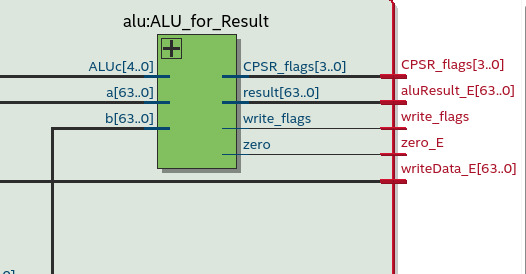

# Informe de Laboratorio - ARMv8 en SystemVerilog

### Arquitectura del Computador - 2024
### Integrantes: 
- Rodrigo Agustín Quevedo
- Mateo Malpassi
- Eleonora Constanza Gómez Vera

---

## Índice

1. [Introducción](#introducción)
2. [Primeras modificaciones](#primeras-modificaciones)
3. [Ejercicio 1](#ejercicio-1)
4. [Ejercicio 2](#ejercicio-2)
5. [Conclusión](#conclusión)
6. [Ejercicio 3](#ejercicio-3)

## Introducción

El laboratorio consiste en la implementación del microprocesador ARMv8 en SystemVerilog. Durante el transcurso de este laboratorio aplicamos los conceptos aprendidos sobre microprocesadores y pipeline como técnica de mejora de rendimiento. 
Se utilizó la herramienta Quartus para analizar y sintetizar el código en System Verilog que describen circuitos secuenciales y combinacionales.

## Primeras modificaciones
Se modificó el modulo #regfile para hacer "forwarding" utilizando las recomendaciones inciales. De esta manera queda implementado el procesador con pipeline. Para probarlo utilizamos el código dado en el enunciado agregandole "nops" para evitar hazards y extendiendo las direcciones de memoria de la ROM.

## Ejercicio 1
Para agregar las instrucciones ADDI y SUBBI agregamos los opcodes al modulo maindec con sus respectivas señales de control. En el modulo aludec se agregó ADDI y SUBI con sus respectivos alucontrol (acá la alu nos dice que operación hacer). Por último en el signext extendimos el signo del inmediato.
Para probar que la implementación sea correcta se realizaron los siguientes tests:

	// TEST ADDI de prueba (X3 = X5 + 4)
	ADD X3, X5, #4
		ADD XZR, XZR, XZR
		ADD XZR, XZR, XZR
	STUR X3, [X0, #176]  // Guardamos el resultado de ADDI en MEM 22:0x9
	
	// TEST SUBI de prueba (X3 = X7 - 5)
	SUB X3, X7, #5
		ADD XZR, XZR, XZR
		ADD XZR, XZR, XZR
	STUR X3, [X0, #184]  // Guardamos el resultado de SUBI en MEM 23:0x2

Dichos tests fueron traducidos a hexadecimal e ingresados en el módulo imem.

## Ejercicio 2:
- Maindec -> Agregamos los opcodes de ADDIS, SUBBIS, ADDS, SUBBS y B.cond con sus respectivas señales de control. También agregamos una nueva señal de control llamada condBranch que nos dice si se está ejecutando una instrucción de salto condicional.
- Aludec -> Implementamos la lógica de la ALU para ADDIS, SUBBIS, ADDS y SUBS. La señal de alucontrol a diferencia de ADDI, SUBBI, ADD y SUB ahora tiene un 1 en el bit más significativo.
- Alu ->
Modificamos la Alu para que genere las flags: Zero, Overflow, Negative y Carry. Además implmenetamos la lógica de que dependiendo la instrucción nos diga si tenemos que escribir flags. Entonces, cuando se ejecuta una instrucción que setea flags hacemos update de las flags según la instrucción correspondiente. El nuevo registro implementado CPSR_flags almacena el estado de las flags.

Implementamos el complemento a dos para la resta.
- Bcondcheck -> Este nuevo modulo tiene la función de almacenar las flags y editarlas cuando llega una señal positiva de write_flags. Si es que se ejecuta una instrucción de salto el módulo se encarga de verificar si se toma el salto o no. 
Dentro del módulo, separamos según el tipo de condición de salto y si chequeamos si se cumple la condición. En caso afirmativo se setea en 1 la señal de branch.

- Memory -> Añadimos compuertas para mejorar la lógica de salto ya que ahora contamos con dos señales de control, CBZ y B.cond. 

- Datapath -> Se le agregó un bit más al ff id_ex y ex_mem para la nueva señal de control. 

Para testear esta parte del procesador se crearon los siguientes tests:

	//TEST BRANCHS CONDICIONALES
	
	//TEST B.EQ
	//Si funciona: Guarda en Mem25 el valor 0xA y en Mem24 el valor 0x0
	TEST_EQ:
		ADDS X3, X0, #0
		B.EQ EQ_TAKEN
		ADD X3, X3, #8
			ADD XZR, XZR, XZR
			ADD XZR, XZR, XZR
		STUR X3, [X0, #192] 
	EQ_TAKEN:
		ADD X3, X5, X5
			ADD XZR, XZR, XZR
			ADD XZR, XZR, XZR
		STUR X3, [X0, #200]
	
	//TEST B.NE
	//Si funciona: Guarda en Mem27 el valor 0xB y en Mem26 el valor 0x0
	TEST_NE:
		ADDS X3, X0, X1
		B.NE NE_TAKEN
		ADD X3, X3, #8
			ADD XZR, XZR, XZR
			ADD XZR, XZR, XZR
		STUR X3, [X0, #208] 
	NE_TAKEN:
		ADD X3, X5, X6
			ADD XZR, XZR, XZR
			ADD XZR, XZR, XZR
		STUR X3, [X0, #216]
	
	//TEST B.LT
	//Si funciona: Guarda en Mem29 el valor 0xC y en Mem28 el valor 0x0
	TEST_LT:
		SUBS X3, X1, X5
		B.LT LT_TAKEN
		ADD X3, X3, #8
			ADD XZR, XZR, XZR
			ADD XZR, XZR, XZR
		STUR X3, [X0, #224] 
	LT_TAKEN:
		ADD X3, X5, X7
			ADD XZR, XZR, XZR
			ADD XZR, XZR, XZR
		STUR X3, [X0, #232]
	
	//TEST B.GT
	//Si funciona: Guarda en Mem31 el valor 0xD y en Mem30 el valor 0x0
	TEST_GT:
		SUBS X3, X5, #1
		B.GT GT_TAKEN
		ADD X3, X3, #8
			ADD XZR, XZR, XZR
			ADD XZR, XZR, XZR
		STUR X3, [X0, #240] 
	GT_TAKEN:
		ADD X3, X5, X8
			ADD XZR, XZR, XZR
			ADD XZR, XZR, XZR
		STUR X3, [X0, #248] 
	
	//TEST B.LO
	//Si funciona: Guarda en Mem33 el valor 0xE y en Mem32 el valor 0x0
	TEST_LO:
		ADDS X3, X1, #0xFFFFFFFFFFFFFFFF //notar que se traduce como subs x3, x1, #0x1
		B.LO LO_TAKEN
		ADD X3, X3, #8
			ADD XZR, XZR, XZR
			ADD XZR, XZR, XZR
		STUR X3, [X0, #240] 
	LO_TAKEN:
		ADD X3, X5, X9
			ADD XZR, XZR, XZR
			ADD XZR, XZR, XZR
		STUR X3, [X0, #248]
	
	//TEST B.HS
	//Si funciona: Guarda en Mem31 el valor 0xF y en Mem30 el valor 0x16
	TEST_HS:
		ADDS X3, X5, X1
		B.HS HS_TAKEN
		ADD X3, X3, #8
			ADD XZR, XZR, XZR
			ADD XZR, XZR, XZR
		STUR X3, [X0, #240] 
	HS_TAKEN:
		ADD X3, X5, X10
			ADD XZR, XZR, XZR
			ADD XZR, XZR, XZR
		STUR X3, [X0, #248]

Lo que se busca con estos tests es que activen la respectiva flag de cada branch en particular para que el salto se tome. Únicamente para el test de HS el salto no se tomará ya que el ejemplo fue pensado para que la flag C sea 0 y no 1. Además, testeamos las instrucciones aritméticas que nos permiten modificar las flags: ADDS, ADDIS, SUBS, SUBIS.

Dichos tests fueron traducidos a hexadecimal e ingresados en el módulo imem.

##  Ejercicio 3:

Todo el ejercicio 3 esta en la Branch: **Forwarding-stall**.

Ahora queremos disminuir la cantidad de nops introducidos manualmente, para esto podemos utilizar la tecnica de forwarding-stall.

El forwarding lo utilizamos para reenviar datos actualizados en caso de que hayamos actualizado algun valor del registro y luego lo utilizamos. Basicamente una dependencia del tipo RAW (Read After Write).

Esto nos resuelve los problemas de RAW's entre instrucciones que no accedan a la memoria, cuando tengamos que hacer forwarding
para instrucciones que accedan a memoria necesitamos hacer un stall (frenar el seguimiento de instrucciones hasta obtener el dato de memoria, que normalmente suele ser 1 clock).

Para implementarlas en nuestro procesador llegamos a la conclusión de que el forwarding se puede hacer en la etapa de **EXECUTE**, utilizamos una unidad llamada "forwarding_unit" que la misma se encarga de verificar que necesitemos el valor actualizado de un registro.

Con respecto al stall, utilizamos una unidad llamada "hazard_unit" dentro de la etapa **DECODE** donde la misma verifica que vamos a utilizar la memoria para actualizar un valor. Al momento de detectar les dice a los ff que guarden su valor (Pc,IF_ID)
y reproduce un **flush** para que no arruine el seguimiento de instrucciones.

El **flush** se hace poniendo en 0 todas las señales de control y en 31 los registros Rn y Rm.

Por último les muestro el funcionamiento:
    Nuestro código utilizado para este test:
    
        ldur x4,[x0,#16]
	    add x7,x4,x1
	    stur x7,[x0,#24]
	    
En la siguiente imagen vemos el comportamiento del **stall**:

Acá podemos observar que el Rn (en nuestro código hace referencia al x4 del ADD) es igual que nuestro Rd(el x4 de nuestro stur)
por ende pone el stall en 0 (hicimos así porque es usado directamente como **enable** de los flopre) deteniendo 1 clock el programa para darle tiempo a poder reenviar la información de ese x4.

En la siguiente imagen vemos el comportamiento del **forwarding**:

En esta imagen nos centramos en el forwarding que se le hace al stur sobre x7. Podemos observar que el Rd de la etapa **MEM** es igual al Rt del stur en etapa **EX** por ende el mux1, que es donde ingresa el valor que usa stur para guardar, le dice que valor tiene que usar (en este caso el del MEM)

Lo unico que quedo por resolver es el tema de los saltos, hay un bug que no pudimos resolver pero en general funciona correctamente.

## Conclusión 
Este laboratorio nos permitió poner en práctica los temas vistos durante la primera etapa de cursado. Empezando por aprender Quartus, una herramienta fundamental para poder visualizar el funcionamiento del procesado, además de permitirnos verificar la funcionalidad de los módulos que lo conforman utilizando test-benches y la herramienta de ModelSim para corroborar valores y estados de las señales manipuladas.

Hemos aprendido a desarrollar la implementación de técnicas de forwarding para evitar hazards, como también aprendimos a detectar a estos mismos y utilizar la técnica forwarding-stall a fin de evitarlos. Además, aprendimos técnicas de mejora de rendimiento (pipeline), crear un circuito que decodifique una instrucción de 32 bits, detectar los problemas y poder ver las señales en la memoria resultante. También implementamos saltos condicionales y las respectivas instrucciones aritméticas que permiten manipular las banderas del microprocesador para determinar si el salto se toma o no. 

Concluimos en que este laboratorio proporciona una idea general de como se maneja un procesador real, siendo un gran punto de inicio para cualquiera que quiera entender qué modificaciones básicas pueden llegar a tener dichos procesadores, que tienen como finalidad mejorar el desempeño del mismo.
