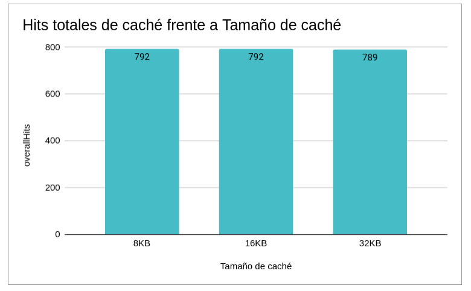

# Arquitectura de Computadoras - 2024
## Informe Lab2:  Análisis de microarquitecturas

## Integrantes:

- Rodrigo Agustín Quevedo
- Mateo Malpassi
- Eleonora Constanza Gómez Vera

## Índice

1. [Introducción](#introducción)
3. [Ejercicio 1](#ejercicio-1)
4. [Ejercicio 2](#ejercicio-2-simulación-física)
6. [Ejercicio 3](#ejercicio-3-bubblesort)
5. [Conclusión final](#conclusión-final)

## Introducción

En este laboratorio pondremos a prueba diferentes microarquitecturas, las cuales serán sometidas a tres benchmarks particulares con el fin de recolectar datos, analizar y comparar los rendimientos de estas mismas. Además, implementaremos técnicas estáticas de mejora como loop unrolling e instrucciones condicionales que nos servirá para visualizar los impactos en los resultados que pueden generar pequeñas mejoras en el código de los benchmakrs.

## Ejercicio 1

### Benchmark “Daxpy” sobre el procesador.

Daxpy (Double-Precision A·X Plus Y) es un benchmark que multiplica vectores y los almacena en posiciones contiguas de memoria. Es utilizado para determinar la performance de microprocesadores, característico por aprovechar la localidad espacial debido a sus accesos secuenciales en memoria, además de ser intensivo en memoria. 

### Resultados benchmark en caché de mapeo directo

La primer tarea que realizamos fué correr el benchmark con caché de mapeo directo y tamaño de caché de datos de 8KB, 16KB, 32KB. Aquí los resultados graficados:

Los gráficos nos permiten ver que, en el caso particular de la caché de mapeo directo, las tres opciones (memorias de 8KB, 16KB y 32KB) tienen diferencias ínfimas. Esto va en contra del concepto "mientras más grande la memoria caché, mejor rendimiento". Atribuimos esta ocurrencia al hecho que las memorias caché de una vía (o de mapeo directo) tienen falta de localidad espacial. 

XXX Aca faltaria un analisis sobre el daxpy

Con localidad espacial nos referimos al "Principio de Localidad y Referencia" visto en clase: en donde, al acceder a una dirección de memoria, lo más probable es que se acceda a otras direcciones cercanas a esa misma dirección. Vemos que en Daxpy se deja en evidencia el defecto de las memorias caché de una vía.

Curiosamente, las memorias de 8 y 16KB tienen un rendimiento ligeramente mejor cuando comparamos con la de 32KB. Podemos concluir entonces en que la mejor opción, entre las tres que tenemos, es optar por una memoria de 8K de mapeo directo ya que no habrá diferencias de rendimiento y ahorraremos recursos.

Como veremos a continuación, las mejoras de performance aparecen con memorias caché de más de una vía.

### Resultados benchmark en caché asociativa de dos vías

Los datos del benchmark con una memoria caché asociativa de dos vías nos dejaron los siguientes resultados:

Lo primero que notamos es la notable mejora al utilizar una memoria asociativa en vez de una de mapeo directo. La cantidad de hits totales y hits de lectura aumentan considerablemente, además de haber disminuido la cantidad de ciclos ociosos y la cantidad de ciclos totales.

La mejora la atribuimos al aumento de localidad espacial que nos aporta utilizar una memoria asociativa, provocando así que el rendimiento del procesador mejore.

XXX Los atributos de localidad espacial y temporal del programa no cambian al cambiar el cache

Sin embargo, nuevamente los rendimientos de las tres memorias caché son muy similares, lo cual nos lleva a concluir que, teniendo en cuenta el costo de memorias caché con mayor almacenamiento, conviene elegir la de 8KB.

### Resultados benchmark en caché asociativa de cuatro y ocho vías

La última tarea a realizar era correr la simulación con memorias asociativas de cuatro y ocho vías. Aquí los resultados:

Como vimos anteriormente, al aumentar las vías, aumentarán los hits totales y los hits de lectura. Las mejoras por sobre una memoria asociativa de dos vías están a la vista, aunque cabe mencionar que ambas memorias necesitan de más ciclos para completar la ejecución del programa; en este aspecto, la memoria de dos vías requiere de una cantidad notoriamente menor de ciclos. 

Destacamos el hecho de que entre una memoria caché de cuatro y ocho vías los resultados son prácticamente iguales.

### Mejora del código y comparación con procesador out-of-order

La siguiente actividad que tuvimos que realizar (ejercicio uno, inciso e) fué aplicar técnicas estáticas de mejora en el código del benchmark Daxpy, utilizando una memoria caché de mapeo directo y de 32KB. Lo que se busca es que se obtenga un rendimiento similiar a cuando utilizamos una memoria caché asociativa de dos vías y de 32KB.

La técnica aplicada fue la de “Loop Unrolling”. Con esta técnica lo que buscamos es evitar ejecutar menos iteraciones del bucle, realizando varias operaciones en una sola iteración; esto nos permite aprovechar la localidad espacial, mejorar el rendimiento, entre otras ventajas.

#### Análisis de código optimizado vs no optimizado, con procesador in-order

Comparamos el código optimizado con una vía de caché vs el código sin mejorar pero con caché de dos vías. Ambos con 32KB de tamaño de caché y con el procesador in-order. Los resultados obtenidos fueron los siguientes:

En este caso particular, no obtuvimos los resultados esperados. El procesador in-order con la memoria caché asociativa de dos vías sigue teniendo un rendimiento altamente superior; es más, inclusive llegamos a tener un peor rendimiento si comparamos el código optimizado en un procesador in-order con caché de mapeo directo, con el procesador in-order con caché de mapeo directo sin optimizar el código: Notamos que en los datos recolectados de hits totales de caché y hits de lectura tenemos un rendimiento peor.

En nuestro caso probamos de dos hasta ocho elementos subsecuentes, y realmente no encontramos una mejora. El gráfico mostrado es de dos elementos por ciclo, ya que creemos que con está técnica empeora la situación y este es el peor caso.

No sabemos dar una explicación exacta del por qué sucede esto, nuestra hipótesis es que es debido al pisoteo de lineas ya que es bastante probable la repetición del tag. Accedemos a muchas direcciones de memoria (X,Y,Z) por ende no creemos que es descabellado pensar que el tag puede repetirse y por ende terminar pisando alguna línea en cache, Esto explicaría porqué el loop unrolling no lo resuelve y las dos vías sí.

XXX Si el codigo "optimizado" no mejora el rendimiento, entonces no es optimizado. Viendo el codigo, el problema es que no analizaron de donde viene la mejora entre el cache de 1 via y 2

#### Análisis de código optimizado, procesador in-order vs out-of-order

En el punto uno, inciso f del laboratorio se busca concluir el ejercicio con una comparación entre el procesador in-order con el procesador out-of-order, ejecutando el código optimizado con la técnica de Loop Unrolling que utilizamos en el inciso anterior y utilizando una memoria caché de 32KB de mapeo directo.

Los resultados obtenidos fueron los siguientes:

Como podemos apreciar, el rendimiento del procesador out-of-order en este benchmark es altamente superior: Necesita menos ciclos totales para ejecutar el programa, prácticamente no tiene ciclos ociosos, y tanto los hits totales, como los de lectura, triplican a los del procesador in-order.

Es un resultado esperable, ya que el procesador Out-Of-Order reduce los ciclos ociosos producidos por dependencias debido a su forma de ejecutar instrucciones, además tiene la capacidad de reordenar el código de una manera conveniente para ejecutar el programa más rápido, entre otras mejoras vistas en clase que justifican los resultados obtenidos.

## Ejercicio 2: Simulación Física

Utilizando el benchmark "simFisica", que pretende simular el flujo de calor en una placa de un material uniforme, se nos propuso correr la simulación utilizando una memoria caché de mapeo directo de 32KB, junto a un predictor de saltos local. Luego, debíamos comparar los resultados obtenidos con los resultados arrojados utilizando cachés asociativas de dos, cuatro y ocho vías de 32KB. Aquí los datos obtenidos:

La pregunta que se formula es ¿En qué caso se obtiene la mejor performance? Lo que notamos es que utilizando una caché asociativa de dos vías obtendremos el performance óptimo.

Si vemos la implementación del código del benchmark utilizado, notamos que constantemente se están accediendo a los arreglos "x" y "x_temp", esto provoca que tengamos que hacer accesos a memoria constantemente. Esto nos da una idea del por qué con la caché de mapeo directo no se obtiene buen desempeño, básicamente al ser una matriz relativamente grande y tenerlo en bloques contiguos aumenta las probabilidades de pisotear las lineas en caché, perdiendo la posibilidad de realizar un hit; este problema se soluciona al utilizar una memoria asociativa de dos vías guardando ambos arreglos en caché.

Si comparamos con las memorias asociativas de cuatro y ocho vías, las diferencias son pequeñas, pero las hay. Podemos concluir en que al dividir en más vías la memoria caché menos capacidad de almacenamiento va a tener dicha memoria en cada set, provocando que tengamos que hacer más accesos a memoria principal para obtener los datos requeridos.

### Apartados d y e: Comparación entre predictores de saltos

Esta actividad consistía en comparar el predictor de saltos local y el predictor por torneos, utilizando la memoria caché que mejor nos dió resultado en el apartado c de este mismo ejercicio: la memoria asociativa de dos vías de 32KB.

Nuestro análisis pre-resultados:
En nuestro código contamos con cinco if y cuatro for. Creemos que el predictor global será mucho más eficiente para los if's ya que algunos if pueden deducirse de resultados anteriores, por el contrario para los for será más eficiente un predicor de saltos local, ya que estos solamente dependen de si mismos y no del contexto.

Con lo dicho anteriormente, nuestra hipótesis es que debería mejorar drásticamente los resultados con un predictor de torneo, ya que el mismo utiliza ambos y con el tiempo va afianzando la decisión de cual tomar en cual caso, llegando así a altos niveles de performance.

Debíamos correr el benchmark de "simFisica" y obtener el MissRate de cada uno. Aquí los resultados:

Notamos que el predictor por torneos tiene menor MissRate, por lo tanto mejor desempeño. Esto lo podemos atribuir al hecho de que el predictor por torneos, comparado con el predictor local, combina predictores globales y locales en su implementación, permitiéndole así adaptarse dinámicamente a cada situación particular. En cambio, el predictor local sólo basa su predicción en base a su historial de acceso a memoria en una dirección.

La siguiente tarea a realizar consistía en comparar los resultados obtenidos con el predictor de saltos por torneos con un procesador out-of-order y la caché asociativa de dos vías de 32KB; para luego comparar los resultados con el inciso anterior. Aquí los resultados graficados:

Concluimos en que no hay mejoras de rendimiento utilizando un procesador out-of-order, como podemos ver tienen el mismo MissRate. El análisis pertinente que podemos hacer es que el predictor por torneos no se ve afectado por un procesador out-of-order, ya que no le interesa en qué orden se ejecutan las instrucciones, sino que su desempeño dependerá de los predictores locales y globales que lo constituyan.

XXX Faltaria analisar el impacto sobre los total cycles

## Ejercicio 3: BubbleSort

Como caso de análisis para este ejercicio, utilizamos el método de ordenamiento por burbuja.

Primero implementamos dicho método y corrimos la simulación del benchmark utilizando un predictor de saltos por torneo y una memoria caché de mapeo directo de 32KB. Luego, en el inciso b, se nos pedía modificar el código utilizando instrucciones condicionales las cuales sirven para evitar la ocurrencia de saltos y así obtener un mejor rendimiento.

El código de bubbleSort modificado se encuentra en un archivo dentro de la carpeta benchmarks.

Los gráficos con los resultados obtenidos son los siguientes:

Por más de que hayamos hecho las respectivas implementaciones de técnicas estáticas de mejora (en este caso, la utilización de instrucciones condicionales), no obtuvimos mejoras en ningún aspecto. Creemos que es porque en nuestra implementación no se podía sacar mucho jugo de este tipo de instrucciones, en otro tipo de implementación donde se hagan muchos más saltos se podria sacar una mejor performance evitando cálculos de dichos saltos. Ya que la idea en esencia con estas instrucciones es evitar la mayor cantidad de branch's posibles.

XXX Esto es mu extra~no. Deberian analizar el number of branch predicted y comprobar que efectivamente bajo mucho. Sino es asi entonces hay un error en los experimentos
### Análisis apartado d) con procesador Out-Of-Order

En este caso, analizamos el método de bubbleSort con un procesador out-of-order. Los resultados son los siguientes:

El análisis no dista de lo dicho anteriormente. La optimización del código no hace diferencia en rendimiento. Lo único destacable es que el procesador out-of-order, como se mencionó anteriormente en este informe, es mejor en rendimiento cuando lo comparamos con el procesador in-order; las razones ya las hemos explicado.

# Conclusión Final 

En este laboratorio aprendimos a implementar benchmarks utilizados en la industria para poner a prueba microarquitecturas con diferentes memorias caché. Además, tuvimos la tarea de obtener y filtrar los datos de interés que el simulador arrojaba, para luego comparar y analizarlos; desarrollando así nuestra capacidad de análisis crítico.

Según los análisis hechos producto de los resultados obtenidos podemos concluir lo siguiente:

- El procesador out-of-order y las memorias asociativas son los que mejor rendimiento tuvieron durante el transcurso del laboratorio en general.
- La aplicación de técnicas estáticas de mejoras no funcionaron como esperábamos, aportando casi nula mejora en el rendimiento.

Más allá de los resultados en sí, también cabe resaltar que en este laboratorio hemos puesto a prueba diferentes predictores de salto (local, por torneo) con memorias caché de diferentes tipos (ya sean de mapeo directo o asociativas, con diferentes capacidades de almacenamiento) y con diferentes procesadores (in-order, out-of-order). También apicamos técnicas estáticas de mejora como loop unroling y el uso de instrucciones condicionales.

Todas las actividades realizadas nos permitieron poner en práctica la teoría y dar un pantallazo general del desempeño de los procesadores, memorias caché, técnicas para mejorar el código y predictores de saltos vistos en la segunda parte de la materia.

